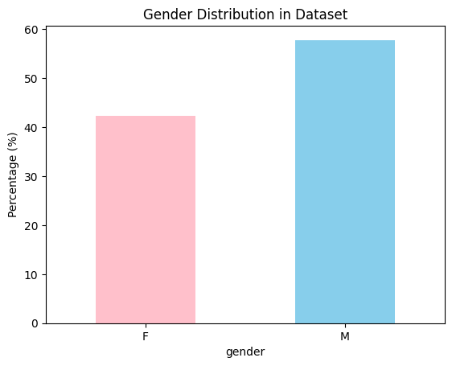

<!-- _class: lead -->

# Team 1

Utkarsh, Varun, Gloria, Jason

---
<!-- _class: lead -->

# Basic EDA

- Preliminary results from the paper that we were able to reproduce (almost exactly, with all values lying between the 95% CI):
    - Sample Set (36,607 vs. 36,390)
    - M:F ratio (57.8:42.2 - **EXACTLY RIGHT**)
    - Multimorbidity Percentage (76.8% vs. 77.3%)
    - Overall Mortality Rate (10.82% vs. 10.9%)
---

<!-- _class: lead -->

  
  
  

---
<!-- _class: lead -->
# Visualizing Plots

- Creating Materialized Views:
    - varun_filtered_patients
    - varun_morbidity_counts
    - varun_filtered_patients_with_morbidity_counts
    - varun_multimorbidity_by_age_bracket_1a

- Using the final MV, and some code in python, we were able to recreate the visualization of Fig 1a:

---
# Figure 1a

<!-- _class: lead -->

---
# K-Means

- Goal: Replicated the paper’s k-means clustering step to uncover multimorbidity patterns across age brackets in MIMIC-III.

- Method: SQL-based ICD-9 flag extraction → prevalence by age group → NumPy K-means (K=3) + PCA visualization.

- Result: Clear separation of clusters — younger addiction-related vs. older cardiometabolic disease profiles.

- Visualization: Heatmap of disease prevalence, PCA scatter, and cluster-center bar charts showing top varying features.

---
<!-- _class: lead -->

  
  
  

---
# Next Steps

In the following week we plan to:
- Reproduce more plots from the paper.
- Start conducting LCA and K-Means to reproduce the findings from the paper.
